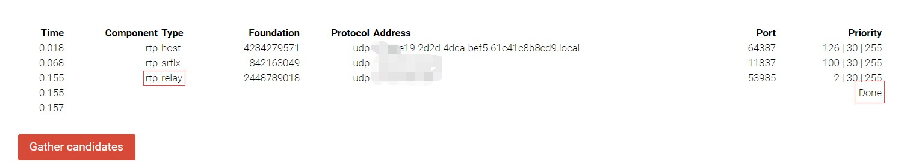

# Springboot+vue基于kurento实现浏览器p2p视频通话

&emsp;&emsp;kurento 官网提供了 springboot 一对一的视频通话的 demo，我需要将它移植到我们的 springboot+vue 的前后端分离的类似于 QQ 聊天项目中。移植时遇到了不少问题，于是放弃了 demo 中使用的 Spring-websocket 方案，使用 spring-boot-starter-websocket 重写。

&emsp;&emsp;由于我不负责前端，所以此处仅放出我用于测试用的前端代码。若要将 vue 正常跑通，请自行完善 vue 项目。

## 1、环境配置

### 1. 安装 kurento 媒体服务器

&emsp;&emsp;WebRTC是一组协议和 api ，可通过对等连接为浏览器和移动应用程序提供实时通信（RTC）功能。而 kurento 在它的基础上提供了更多的功能：媒体传输，处理，记录和播放等。详细介绍请前往 [kurento 官网](https://doc-kurento.readthedocs.io/en/stable/index.html) 查看。

&emsp;&emsp; kurento 媒体服务器仅支持直接安装在 Ubuntu 上。为了能够在 win10 平台安装测试、在 centos7 服务器上运行，只能通过 docker 安装。安装命令如下：

```bash
docker pull kurento/kurento-media-server:latest

docker run -itd --name kms -p 8888:8888 kurento/kurento-media-server:latest /bin/bash
```

&emsp;&emsp;安装完成后可用如下命令验证：

```bash
curl \
    --include \
    --header "Connection: Upgrade" \
    --header "Upgrade: websocket" \
    --header "Host: 127.0.0.1:8888" \
    --header "Origin: 127.0.0.1" \
    http://127.0.0.1:8888/kurento

```

如果出现如下结果，则说明安装成功：

```bash
HTTP/1.1 500 Internal Server Error
Server: WebSocket++/0.7.0
```

### 2. 安装 stun/turn 打洞服务器

&emsp;&emsp; 由于 NAT 隐藏了端点的真实IP地址，端点之间建立端到端直接连接就非常困难。这就需要 stun 和 turn 服务器的协助。stun 为端点提供公共 IP 地址建立 p2p 连接，如果连接成功，则不再需要中继的协助。如果 NAT 穿透失败，那么就需要使用 turn 服务器提供中继服务进行通讯。

&emsp;&emsp;网上关于 stun/turn 服务器的部署教程非常多。由于安装 kurento 时使用了 docker，所以这里直接使用 docker 安装。github 上有人将所有操作写在了 dockerfile 里，直接使用这个安装更方便，避免踩坑。[https://github.com/konoui/kurento-coturn-docker.git](https://github.com/konoui/kurento-coturn-docker.git)

```bash
cd /kurento-coturn-docker/coturn/
# 记住加点
sudo docker build --tag coturn .
# 后台运行 coturn
sudo docker run -p 3478:3478 -p 3478:3478/udp coturn
```

&emsp;&emsp;该 dockerfile 配置 turn 的用户名和密码都是 kurento。如需自定义，请在 dockerfile 文件中的 26-27 行中自定义。

```docker
ENV TURN_USERNAME kurento
ENV TURN_PASSWORD kurento
```

&emsp;&emsp; 然后前往 [https://webrtc.github.io/samples/src/content/peerconnection/trickle-ice/](https://webrtc.github.io/samples/src/content/peerconnection/trickle-ice/) 该网站中输入 ```turn:ip:3478``` 以及用户名密码，出现如图所示的 relay 和 done 说明成功。



### 3. kurento 设置打洞服务器地址

&emsp;&emsp; 直接进入 docker 找到 kurento 的配置文件：

```bash
 docker exec -it kms /bin/bash

 apt-get update
 apt-get install vim

 cd /etc/kurento/modules/kurento/
 vim WebRtcEndpoint.conf.ini
```

&emsp;&emsp;添加一行：

```ini
turnURL=用户名:密码@ip:3478?transport=udp
```

## 1.5、运行 kurento 官网提供的 demo

&emsp;&emsp;[这是官网提供的一对一视频 demo](https://doc-kurento.readthedocs.io/en/stable/tutorials/java/tutorial-one2one.html?)。按照里面提供的 github 地址克隆到本地然后可以打包运行。

&emsp;&emsp;注意，如果要运行 kurento 官网中的 demo，可能会无法正常通话。默认情况下，demo 调用的 stun 服务器是它自己的。正如官网所说，如果需要使用自己配置好的 stun 服务器，需要执行如下命令：

```bash
mvn -U clean spring-boot:run -Dkms.url=ws://kms_host:kms_port/kurento
```

&emsp;&emsp;但我依然无法成功。所以需要在 demo 中的 index.js 中添加自己的配置。在 ```function call()``` 和 ```function incomingcall()``` 的 ```var options = {...}``` 之前添加：

```javascript
// 添加自己的中继服务器的配置，否则会默认指向谷歌的服务器
var iceservers = {
    "iceServers": [
    {
        urls:"stun:your_server_ip:3478"
    },
    {
        urls: ["turn:your_server_ip:3478"],
        username: "kurento",
        credential: "kurento"
    }
    ]
};
```

&emsp;&emsp;然后对 options 进行如下修改：
```
var options = {
    localVideo: videoInput,
    remoteVideo: videoOutput,
    onicecandidate: onIceCandidate,
    onerror: onError,
    configuration: iceservers
};
```

&emsp;&emsp;这样就能运行成功。

## 2、后端实现

&emsp;&emsp;springboot 所需依赖为：

```xml
<dependency>
    <groupId>org.springframework.boot</groupId>
    <artifactId>spring-boot-starter-websocket</artifactId>
</dependency>
<dependency>
    <groupId>org.kurento</groupId>
    <artifactId>kurento-client</artifactId>
</dependency>
<dependency>
    <groupId>org.kurento</groupId>
    <artifactId>kurento-utils-js</artifactId>
</dependency>
```

&emsp;&emsp;前后端使用 websocket 进行通信。VideoHandler 类注册为一个实例，负责处理 ```/videoCall``` 的通信。方法 ```onMessage()``` 用于接受消息，根据消息类型调用不同的方法进行处理：

```java
@OnMessage
public void onMessage(Session session, String message) throws Exception {
    JsonObject jsonMessage = gson.fromJson(message, JsonObject.class);
    UserSession user = getUserSessionBySession(session);
    switch (jsonMessage.get("type").getAsString()) {
        case "login":
            try {
                login(session, jsonMessage);
            } catch (Throwable t) {
                ErrorResponse(t, session, "loginResponse");
            }
            break;
        case "call":
            try {
                call(user, jsonMessage);
            } catch (Throwable t) {
                ErrorResponse(t, session, "callResponse");
            }
            break;
        case "incomingCallResponse":
            incomingCallResponse(user, jsonMessage);
            break;
        case "onIceCandidate": {
            JsonObject candidate = jsonMessage.get("candidate").getAsJsonObject();
            if (user != null) {
                IceCandidate cand =
                        new IceCandidate(candidate.get("candidate").getAsString(), candidate.get("sdpMid")
                                .getAsString(), candidate.get("sdpMLineIndex").getAsInt());
                user.addCandidate(cand);
            }
            break;
        }
        case "stop":
            stop(session);
            break;
        default:
            break;
    }
}
```

&emsp;&emsp;当收到前端发送 ```type = login``` 的消息时，用户的在线状态得以记录在 HashMap 中；

```java
// 这里存储 useruserID-UserSession
private static ConcurrentHashMap<String, UserSession> usersByUserID = new ConcurrentHashMap<>();
// 这里则是 Session.id-UserSession
private static ConcurrentHashMap<String, UserSession> usersBySessionId = new ConcurrentHashMap<>();

private void login(Session session, JsonObject jsonObject) throws IOException {
    String userID = jsonObject.get("userID").getAsString();
    UserSession user = new UserSession(session, userID);
    usersByUserID.put(userID, user);
    usersBySessionId.put(session.getId(), user);
    logger.info("userID: " + userID + "is online.");
}
```

&emsp;&emsp;当收到 ```type = call``` 的消息时，服务器判断被呼叫者是否在线/正忙，如果在线且空闲就发送消息给被呼叫者，等待他的应答；

```java
private void call(UserSession caller, JsonObject jsonMessage) throws IOException {
    String callerID = jsonMessage.get("callerID").getAsString();
    String calleeID = jsonMessage.get("calleeID").getAsString();

    JsonObject response = new JsonObject();
    if (!exists(calleeID)) {
        response.addProperty("type", "callResponse");
        response.addProperty("callResponse", "notOnline");
        caller.sendMessage(response);
        logger.info("videoCall: " + callerID + " call to " + calleeID + ": NotOnline.");
        return;
    }

    UserSession callee = getUserSessionByUserID(calleeID);

    // 判断对方是不是正忙
    if (callee.getState() == 1) {
        response.addProperty("type", "callResponse");
        response.addProperty("callResponse", "isBusy");
        caller.sendMessage(response);
        logger.info("videoCall: " + callerID + " call to " + calleeID + ": isBusy.");
        return;
    }

    // 设置呼叫者正忙状态
    caller.setStateCalling();

    caller.setSdpOffer(jsonMessage.getAsJsonPrimitive("sdpOffer").getAsString());
    caller.setCallingTo(calleeID);

    response.addProperty("type", "incomingCall");
    response.addProperty("callerID", callerID);

    callee.sendMessage(response);
    callee.setCallingFrom(callerID);
    logger.info("videoCall: " + callerID + " call to " + calleeID + ": send incomingCall to " + calleeID);
}
```

&emsp;&emsp;当收到 ```type = incomingCallResponse``` 的消息时，如果被呼叫者接受了消息，服务器将创建一个 CallMediaPipeline 对象，以封装媒体管道的创建和管理，然后，该对象用于与用户的浏览器协商媒体交换......

&emsp;&emsp;代码过长，请点击 [VideoHandler.java](https://github.com/huangwg2529/videoCall-springboot-vue/blob/master/src/main/java/com/hwg/videocall/video/VideoHandler.java) 查看。

&emsp;&emsp;详细的 websocket 通信流程以及格式请查看 [websocket流程](https://github.com/huangwg2529/videoCall-springboot-vue/blob/master/websocket%E9%80%9A%E4%BF%A1%E6%B5%81%E7%A8%8B.md)。

&emsp;&emsp;此外，springboot 项目必须配置 https。

## 3、vue 实现

&emsp;&emsp;vue 的主要实现请查看 [socketForVideo.js](https://github.com/huangwg2529/videoCall-springboot-vue/blob/master/vue/socketForVideo.js) 。并且在 vue 项目的 ```main.js``` 中把它设为全局 api 供调用：

```javascript
import * as wssApi from './assets/js/socketForVideo.js'
Vue.prototype.$wssApi = wssApi
```

&emsp;&emsp; vue 中使用 websocket 与后端进行通信:

```
let wss = new WebSocket('wss://localhost:8443/videoCall'); 

function sendMessage(message) {
	var jsonMessage = JSON.stringify(message);
	console.log('Sending message: ' + jsonMessage);
    wss.send(jsonMessage);
}
```

&emsp;&emsp;当用户登录成功时，需要调用 login 函数告知服务器：

```javascript
this.$wssApi.login(userID);
```

其中 login() 的代码：
```javascript
export function login(loginID) {
	var loginMessage = {
		type: 'login',
		userID: loginID
	};
	sendMessage(loginMessage);
}
```

&emsp;&emsp;当用户点击通话按钮向好友发起通话时，调用 call() 函数，启用 webrtc 通信，调用摄像头，并向服务器发送申请:

```javascript
export function call(callerID, calleeID) {
	callerIDtmp = callerID;
	calleeIDtmp = calleeID;
	// 添加自己的中继服务器的配置，否则会默认指向谷歌的服务器
	var iceservers = {
		"iceServers": [
		{
			urls:"stun:your_server_ip:3478"
		},
		{
			urls: ["turn:your_server_ip:3478"],
			username: "kurento",
			credential: "kurento"
		}
		]
	};
	var options = {
		localVideo : videoInput,
		remoteVideo : videoOutput,
		onicecandidate : onIceCandidate,
		onerror: onError,
		configuration: iceservers
	}
	// 调js库，启用WebRtc通信
	webRtcPeer = new kurentoUtils.WebRtcPeer.WebRtcPeerSendrecv(options,
			function(error) {
				if (error) {
					return console.error(error);
				}
				webRtcPeer.generateOffer(onOfferCall);
			});
}

function onOfferCall(error, offerSdp) {
	if (error)
		return console.error('Error generating the offer');
	console.log('Invoking SDP offer callback function');
	var message = {
		type : 'call',
		callerID : callerIDtmp,
		calleeID : calleeIDtmp,
		sdpOffer : offerSdp
	};
	sendMessage(message);
}
```

&emsp;&emsp;vue 中同样需要针对服务器发来的不同消息进行不同的处理：

```javascript
wss.onmessage = function(message) {
	var parsedMessage = JSON.parse(message.data);
	console.info('Received message: ' + message.data);

	switch (parsedMessage.type) {
	case 'loginResponse': 
		// registerResponse(parsedMessage);
		break;
	case 'callResponse': // 用户主动发起通话时会向服务器发送消息，服务器处理结果会返回该消息(不在线、拒绝、同意等)
		callResponse(parsedMessage);
		break;
	case 'incomingCall': // 用户收到了其他人的通话申请，就会收到服务器发来的这个消息
		incomingCall(parsedMessage);
		break;
	case 'startCommunication': // 被呼叫者同意申请后，服务器处理时会发来这个消息
		startCommunication(parsedMessage);
		break;
	case 'stopCommunication': // 对方主动停止通话，你会收到这个消息
		console.info('Communication ended by remote peer');
		stop(true);
		break;
	case 'iceCandidate':
		webRtcPeer.addIceCandidate(parsedMessage.candidate, function(error) {
			if (error)
				return console.error('Error adding candidate: ' + error);
		});
		break;
	default:
		console.error('Unrecognized message', parsedMessage);
	}
}
```

例如在发起通话申请时会收到服务器的处理结果，需要处理对方是否在线、拒绝等情况。如果对方接受，则开启视频通话：
```javascript
function callResponse(message) {
	if (message.callResponse == 'notOnline') { // 对方不在线
		console.info('Your friend is not online. Closing call');
		// stop();
	} else if(message.callResponse == 'isBusy' ) { // 对方正忙
		console.info('Your friend is busy. Closing call');
		stop();
	} else if(message.callResponse == 'rejected') {
		console.info('You are rejected.');
		stop();
	} else {
		webRtcPeer.processAnswer(message.sdpAnswer, function(error) {
			if (error)
				return console.error(error);
		});
	}
}
```
